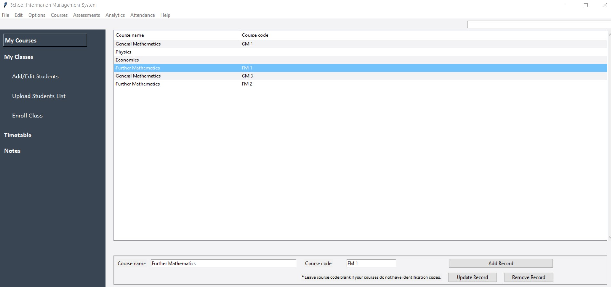
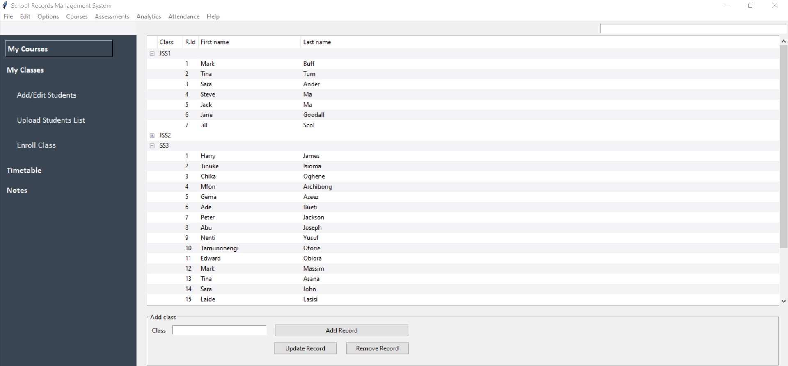
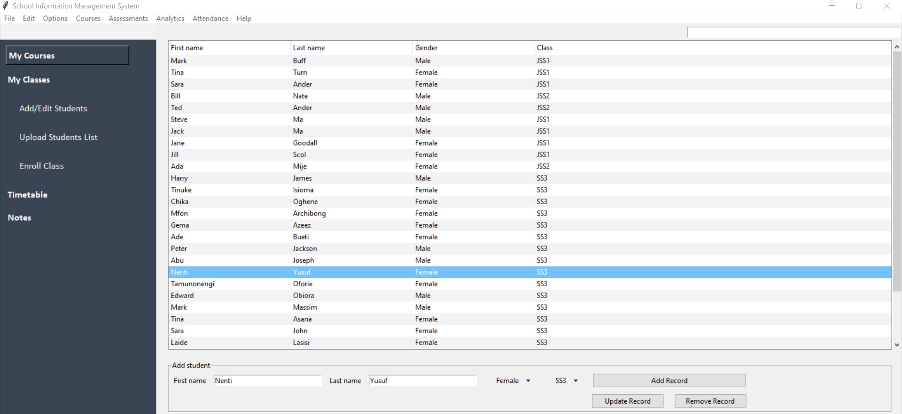
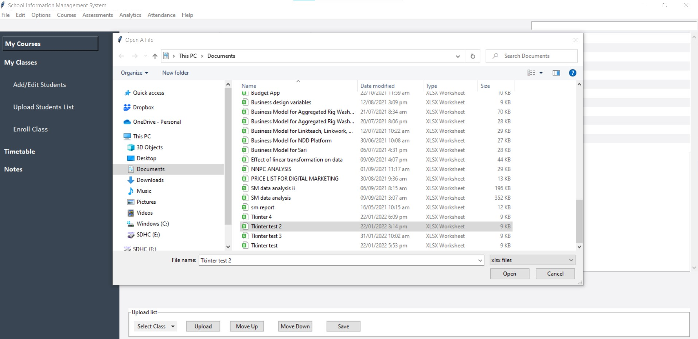

# SIMS

### A secure PC app designed for use by a high school teacher to manage students' records.

### This application is a Graphical User Interface (GUI) with an embedded database. With it, the user can keep track of the academic performance of students by storing assessment scores and class attendance logs.
### The app also aids the teacher by computing students' total scores from input grades and determining the respective positions of each student in a class.
 

## Features:
* ### Available offline (works without an internet connection).
* ### Registration and login.
* ### Storage of academic records
* ### Class attendance log
* ### Integration with user's PC directories to allow import of lists of students from existing Excel spreadsheets or CSV files.
* ### Notepad for preparing and saving lesson notes. Notes can be exported to MS Word.
* ### Timetable: a daily outline of classes to be taught. 
 

## Usage:
* Open app  

* Sign up  
Click "Sign Up" to navigate to sign up page.  
Enter username and password (password entered twice for validation).
Click "Create Account"

* Login  
After sign up is complete, navigate to login page.
Enter name and password.

* Add courses  
On successful login, the first page to be viewed is the courses module.  
A navigation bar and file menu are on the page for access to other functionalities.  
"My Courses" tab is pre-selected.  
Here, user can add the various courses she teaches.  
Enter one course at a time and its course code (if applicable) in their respective entry boxes. Click on "Add Record".  
If there is any error in the record, select the course in the display window, edit it in entry box. Then click "Update Record".

* Add classes  
Select "My Classes" tab on navigation bar.  
Enter class and click on "Add Record"

* Add students  
Select "Add/Edit Students" tab to add students individually.

* Select "Upload Students" to import excel spreadsheet containing students' records. (List must have 3 columns- first name, last name and gender)  

 

### Database ERD

### Languages
* Python, SQL

### Libraries:
* Tkinter
* SQLite3
* Numpy
* Pandas
* OS
* PIL

  
